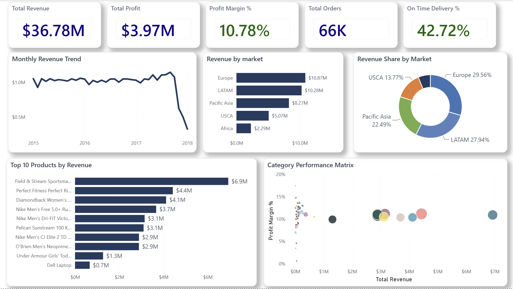
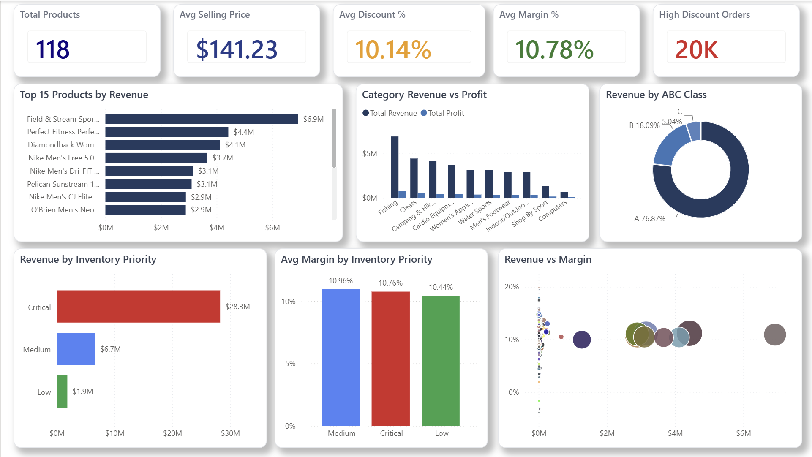
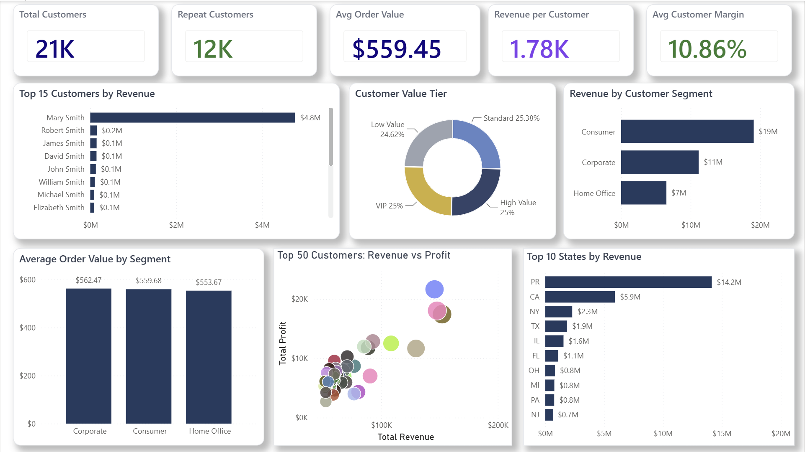
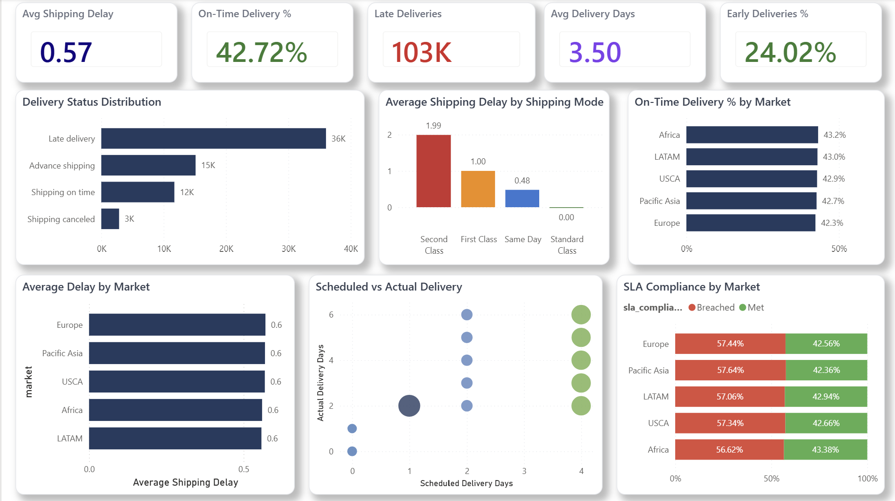
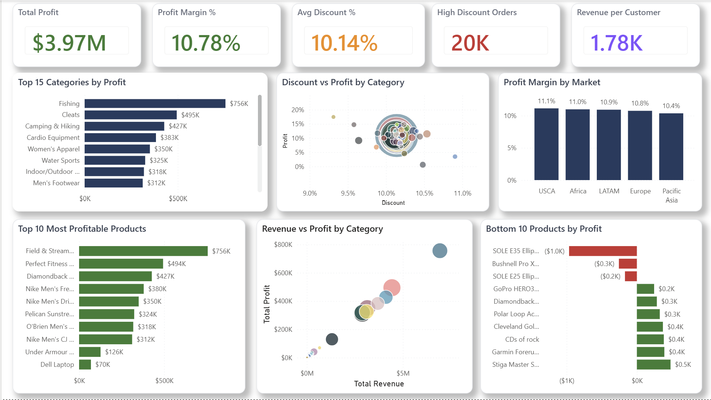

# 📦 Supply Chain & Inventory Analytics Dashboard

## Overview

An end-to-end Supply Chain & Inventory Analytics project built using PostgreSQL and Power BI. The project transforms raw transactional order data into an executive-ready business intelligence solution for analyzing sales performance, inventory efficiency, customer behavior, logistics operations, and profitability.

The solution follows a dimensional modeling approach with SQL-based ETL, analytical views, KPI generation, and an interactive multi-page Power BI dashboard designed for business decision-makers.

---

## Business Objectives

The dashboard helps answer key business questions such as:

- Which products and categories generate the highest revenue and profit?
- Which customers contribute the most value?
- How effective is inventory prioritization?
- Which markets experience the highest shipping delays?
- How does discounting affect profitability?
- Which products are loss-making?
- Which operational areas require improvement?

---

## Tech Stack

- PostgreSQL
- SQL
- Power BI
- DAX
- Power Query
- Git
- GitHub

---

## Dataset

- **180,519 Orders**
- **118 Products**
- **21,000+ Customers**
- Multiple international markets
- Shipping, inventory, customer and profitability data

---

## Project Architecture

```
Raw Dataset
      │
      ▼
 PostgreSQL Database
      │
      ▼
Data Cleaning & Validation
      │
      ▼
Dimensional Model

Fact Table
├── fact_orders

Dimension Tables
├── dim_products
├── dim_customers
├── dim_categories
└── dim_markets

KPI Tables
├── kpi_executive
├── kpi_product
├── kpi_customer
├── kpi_inventory
└── kpi_logistics

Analytical Views
      │
      ▼
Power BI Dashboard
```

---

## Dashboard Pages

- 📊 Executive Overview
- 📦 Product & Category Analytics
- 👥 Customer Analytics
- 🚚 Logistics & Fulfillment Analytics
- 💰 Profitability & Discount Analytics

## Dashboard Preview

### Executive Overview

Provides a high-level summary of overall business performance through key financial and operational KPIs.

<p align="center">
  
</p>

---

### Product & Category Analytics

Analyze product performance, category profitability, inventory prioritization, and the impact of discounts on margins.

<p align="center">
  
</p>

---

### Customer Analytics

Explore customer segments, customer value tiers, repeat purchasing behavior, and geographic revenue distribution.

<p align="center">
  
</p>

---

### Logistics & Fulfillment Analytics

Monitor delivery performance, shipping efficiency, SLA compliance, shipping delays, and market-wise logistics performance.

<p align="center">
  
</p>

---

### Profitability & Discount Analytics

Evaluate product and category profitability, discount effectiveness, margin performance, and identify both top and least profitable products.

<p align="center">
  
</p>

### Executive Summary

- Revenue KPIs
- Monthly revenue trend
- Revenue by market
- Market share
- Category performance
- Top products

---

### Product Analytics

- Product performance
- ABC classification
- Inventory prioritization
- Revenue vs Margin
- Category profitability
- Product profitability

---

### Customer Analytics

- Customer segmentation
- Customer value tiers
- Top customers
- Revenue contribution
- Average order value
- Customer profitability

---

### Logistics Analytics

- Shipping performance
- Delivery status
- Shipping delays
- SLA compliance
- Delivery performance by market
- Shipping mode comparison

---

### Profitability Analytics

- Discount analysis
- Revenue vs Profit
- Profit margin by market
- Top profitable categories
- Top profitable products
- Bottom profit products

---

## KPIs

- Total Revenue
- Total Profit
- Profit Margin
- Total Orders
- Total Customers
- Revenue per Customer
- Average Order Value
- Average Selling Price
- Average Discount
- Inventory Priority
- On-Time Delivery
- Shipping Delay
- Early Deliveries
- High Discount Orders

---

## SQL Highlights

- Star Schema Design
- Fact & Dimension Modeling
- Window Functions
- CTEs
- Ranking Functions
- CASE Expressions
- Aggregate Analytics
- Analytical Views
- KPI Tables

---

## Power BI Features

- Multi-page dashboard
- Interactive slicers
- Drill-through tooltips
- Conditional formatting
- Dynamic KPI cards
- Custom DAX measures
- Scatter analysis
- Executive dashboard layout

---

## Key Business Insights

- Fishing is the highest revenue and profit generating category.
- A small number of products contribute disproportionately to overall revenue.
- High discounts do not consistently translate into higher profitability.
- Inventory prioritization highlights products requiring immediate operational attention.
- Shipping performance varies across markets and shipping modes.
- A handful of products generate negative profit and require pricing or sourcing review.

---

## Project Structure

```
Supply-Chain-Inventory-Analytics/
│
├── assets/
│   ├── executive_overview.png
│   ├── prod_cat_analytics.png
│   ├── cust_analytics.png
│   ├── logi_fulfill_analytics.png
│   └── profit_discount_analytics.png
│
├── data/
│   ├── raw/
│   ├── processed/
│   └── sql/
│
├── notebooks/
│
├── powerbi/
│   └── Supply_Chain_Analytics.pbix
│
├── scripts/
│
├── docs/
│   ├── dashboard_design.md
│   ├── data_dictionary.md
│   └── data_model.md
│
├── requirements.txt
├── README.md
└── LICENSE
```

---

## Author

**Vyom Mangtani**

If you found this project useful, feel free to star the repository.